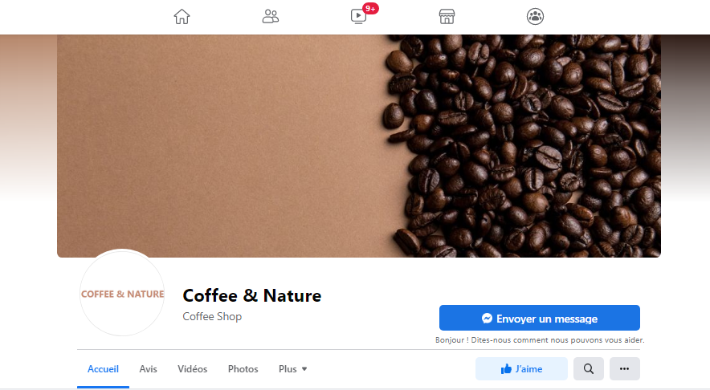
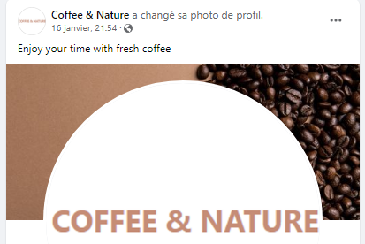

<h1 align="center"> Project 5 for Code Institute formation | COFFEE & NATURE | HTML - CSS - JS - DJANGO</h1>

[View the live project here.](https://project5-coffee-and-nature.herokuapp.com/)

COFFEE & NATURE is an e-commerce site that sells coffee. The store and the coffees are invented for the project.


This project is built as part of a project for the [code institute](https://codeinstitute.net/) (training to become a web developer). 

<h3 align="center"></h3>

The following details shall be used when attempting to submit an order on the checkout page:

Card Number: 4242 4242 4242 4242
Expiration Date: Any future date (e.g. 02/24)
CVC: Any three digits

# Table of content

[About The Project / e-commerce application](#about-the-project-e-commerce-application) 

[Target audience](#target-audience)  

[User Story](#user-story)

[Features](#features)  

[SEO optimisation](#seo-optimisation)

[Web Marketing](#web-marketing)

[Technologies used](#technologies-used)

[Tests](#tests)

[Deployment](#deployment) 

[Credits](#credits)

[Acknowledgments](#acknowledgments)


# About the project e-commerce application
### Type of e-commerce application
This project is an e-commerce application for a small business that sells coffee. It is a B2C (Business to Customer) business and the consumer can order coffee online and pay for the order online.
Because the e-commerce is B2C, the customer is likely to buy impulsively and make their own choice. 

The e-commerce sells products (coffee). The products have a name, description, price, features and a stock keeping unit (SKU). Then the product has to be delivered to a postal address. All this information is stored in the database. 

In order for the customer to find the products, product search and filtering has been implemented and order notifications are sent via email when the transaction is completed.
The transaction is a single payment

### Features to include
- Easy payment gateway
- Authentication system
- search and filtering functionality
- clear product description
- product images
- card and payment system


# Target audience
The target audience is those who want to buy quality coffee while being fair to the farmers and respecting nature.

The audience is expected to be curious to try a new brand of coffee and to be used to enjoying the coffee moment.

Customers are expected to have their own coffee machine.

Custumer are also expected to be nature lovers and could be inspired by anything reminiscent of nature.

# User Experience and Organisation
The details of the design, data organisation, wireframes can be found **[here](UX.md)**.

# User Story

The user stories for this project have been mapped in the github repository under the issues and are the following:

- As a Site admin/superuser, I want to delete existing coffees, so that I can be up to date with the available products.

- As a Site admin/superuser, I want to edit existing coffees, so that I can update the website.

- As a Site admin/superuser, I want to add new products to the website, so that continuously make new coffees available.

- As a Registered user, I want to Easily recover my password in case I forget it, so that Recover access to my account.

- As a Coffee Shopper, I want to Receive email confirmation of my order, so that confirm that my order was successful.

- As a Registered user, I want to Make secure payments, so that ensure that my payments are securely handled.

- As a Registered user, I want to review my purchase at the checkout, so that decide whether to add or edit the order before confirming.

- As a Registered user, I want to leave a review, so that inform future users about the coffee.

- As a Registered user, I want to store my order history, so that access my previous orders.

- As a Registered user, I want to update my details, so that I can update my address and other details in case they change.

- As a Registered user, I want to store my details for later use, so that I avoid having to fill in my details each time.

- As a Registered user, I want to log in and log out of my profile account, so that so that my personal information will be safe.

- As a Unregistered user, I want to easily register an account, so that use the site easier in the future.

- As a Unregistered user, I want to Access contact details, so that get in touch with the coffee shop.

- As a Unregistered user, I want to filter coffee types, so that find specific types of coffees.

- As a Unregistered user, I want to easily navigate the site, so that I can find what I am looking for quickly.

- As a Shopper, I want to Search for a product by name or description, so that I find the products I am interrested in.

- As a Coffee Shopper, I want to Easelly select the quantity of product, so that I buy the amount I want.

- As a Coffee Shopper, I want to Know how the beans have been roasted, so that I can buy the roasted bean I like.

- As a Coffee Shopper, I want to Know the strongness of the coffee, so that I can buy the strongness I want.

- As a Coffee Shopper, I want to Know the specie of the coffee, so that I can buy my favourite specie.

- As a Shopper, I want to easely view the detail of my bag, so that I am aware of the total price and products chosen.

- As a Shopper, I want to view a list of products, so that I can select some to buy them.

- As a Shopper, I want to view individual product details, so that I know the price, the details, the rating.

# Features 

## Site-wide
- Responsiveness

The website is designed to be suitable for all devices. For example, the responsive navigation bar turns into a burger button for phone screens.

- Navbar

The navigation bar is consistent across all pages of the site and follows common practices that users have come to expect from navigation bars, e.g. a drop down menu for burgers appears on small devices, purchases are present with the price below.

- Search bar

The search bar finds cafes that contain the word the user is looking for, either in its name or in its description.

- Toasts

Toasts appear on all pages and provide the user with important information. These toasts also display the coffees that the user may have in their cart.


## Page-specific

- ### Home
The homepage displays a visually appealing hero image of coffee beans, which gives the user a clear idea of the type of website they just visited. It also provides a message about fresh coffee and a "SHOP NOW" button that connects the user to coffees available for purchase.


Under the hero section, there is a section where 4 coffees are displayed randomly with an animation on the large screens. The animation was not kept on the smaller screens because it made the site less clear.
<h3 align="center"></h3>

The next section is about the coffees presented as coming from responsible farmers, and then the countries of origin of the coffees on sale.

<h3 align="center"></h3>

The footer is only present on the home page to keep the user focused on the products. However, in order for users to quickly find product information and store contact information, links are present in the navbar to go directly to the footer to view the information.
The footer contains information about the store, such as its phone number, address and email address and a link to the facebook page of the shop.

- ### Shop

The coffees on sale are displayed on the store page.
Users can filter the coffees by species (Arabica, Robusta, mix of these 2 species), and by whole or ground beans in the COFFEE section of the navigation bar. 

Users have the possibility to sort coffees by price, category, country, robustness, roasting in "SORT BY" in the navigation bar.

<h3 align="center"></h3>

- ### Products details
The product details display information about the coffee (its strength, roast, country of origin) and a picture of the product. Most of the information is already displayed on the product packaging.

In this page, users can select the quantity of the product they want.
<h3 align="center"></h3>


### Admin/Superusers
Have a link to edit and delete the product from the page.


- ### Bag
Allows user to adjust or delete products.
Displays the bag total, delivery and grand total of the order.
If the bag total is below the free shipping threshold, the amount required to qualify for free shipping is displayed.

<h3 align="center"></h3>

- ### Checkout
Displays the order summary and the form to enter the delivery details.

Payment is handled by Stripe.

### Registered users
If the delivery details have been previously recorded, the form will be pre-filled with them.

- ### CRUD (Create, Read, Update, Delete)
- Users can save in "My Profile" information and edit them.
- Superusers can create new products (in "Add a product"), edit and delete products.

## Access protection

Routes are protected using Django's @login_required route decorators to ensure that non-super-users are not able to interfere with the database.

## Redirecting pages
Pages for 404 and 500 errors were created to inform the user when something goes wrong.

## Future
- Design of the product packaging.
- Blog about coffee
- Review


# SEO optimisation
In order to obtain a better ranking in searches, an optimization has been done.
## Keywords
In order to get a better ranking in the search engine, I thought about the keywords that could be searched by users.
I came up with a list that includes the following keywords:
- buy quality coffee (because it is the target user of e-commerce)
- fresh coffee (I thought fresh coffee is important for the quality of the coffee)
- enjoy the moment (Coffee time, at home or at work, is a time to enjoy)
- beans (The store sells ground coffee and beans, but users can look to purchase beans to preserve the freshness of the coffee)
- responsible farmers (The user is supposed to be a nature lover and want to be in tune with nature)
- roasted (There is a variety of roasted coffee in the store and the user can look for a certain type of roast)
- Fair trade (The user is expected to be sensitive to the working conditions of the farmer)
- Organic (The user is expected to be mindful of the chemicals used and wants to be clean with nature while having a healthier drink)

The keywords where then used in the content of the website in h tags, strong tags and in the metadescription.

### meta description and site title
The keywords were then used in the website content in the h tags, strong tags and in the meta description.

### links
The rel="noopener" link to facebook has been added as it does not give information about the content of the site.
An external link to a relevant website was added to improve the ranking of the e-commerce site. The link to fair trade is relevant because the e-commerce site targets people who care about nature.

### Image description
The image description has also been added to each image trying to describe the image well with relevant words used for SEO.

### XML sitemaps file and Robot file
Robots.txt and sitemap.xml have been added to help search engines to better understand the website and to index it correctly.

# Web Marketing
### Organic Social Marketing
Coffee and Nature being a small business could benefit from social marketing. For this project, Facebook was chosen because it is free and widely used.
The Facebook page was created to connect and interact directly with potential customers. It also allows to share content to attract potential customers and to be recognizable. The content can also be shared on Facebook and attract new customers. It can also provide valuable information about what people think about the products and the brand.
<h3 align="center"></h3>
<h3 align="center"></h3>

### email Marketing
A newsletter has been set up with [mailchimp] (https://mailchimp.com/). When the user arrives on the site, a popup form appears and he/she can decide to subscribe to the newsletter or not. For a store like COFFEE and NATURE project, this is a good start for webmarketing as it could increase sales by targeting interested consumers without taking too much time from the people running the business. 

### Triggering curiosity
Another strategy is to stimulate the curiosity of users by naming products after nature. Similarly, on the homepage, random products are displayed to draw the user's attention to new products.

### GDPR 
Because the website collects information about users, the General Data Protection Regulation (GDPR) is important and must be taken into account.
The website has a privacy policy that was generated by [privacypolicygenerator] (https://www.privacypolicygenerator.info/).
    
# Technologies used
## Languages used
- [HTML5](https://en.wikipedia.org/wiki/HTML5)
- [CSS3](https://en.wikipedia.org/wiki/Cascading_Style_Sheets)  
- [js](https://en.wikipedia.org/wiki/JavaScript)  
- [Python](https://en.wikipedia.org/wiki/Python_(programming_language))

## Frameworks
- [Bootstrap](https://getbootstrap.com/)

- [Django](https://www.djangoproject.com/)

- [GreenSock](https://greensock.com/)

- [jQuery](https://jquery.com/)

## Others

- [PostgreSQL](https://www.postgresql.org/) | database used in development mode and database in production mode

- [Git](https://git-scm.com/) | used as version control system

- [Gitpod](https://gitpod.io/workspaces) | used to code, commit to git and push the codes to github

- [GitHub](https://github.com/) | used to store the project code, show it and organize the project using agile tools

- [Balsamiq](https://balsamiq.com/) |  used to create the wireframe

- [Powerpoint](https://simple.wikipedia.org/wiki/Microsoft_PowerPoint) | used to create images from screenshots, work with images, make product images and plan the project

- [excel](https://www.microsoft.com/en-us/microsoft-365/excel) | used to plan the tasks and orgamize the project

- [Word](https://en.wikipedia.org/wiki/Microsoft_Word) | used to correct the grammar

- [am I responsive?](http://ami.responsivedesign.is/) | used to look at the responsiveness of the website and to present an introductory picture in the readme file

- [W3C Markup Validation Service](https://validator.w3.org/) | used to check the validity of the HTML code

- [W3C CSS Validation service](https://jigsaw.w3.org/css-validator/) | used to check the validity of the CSS code

- [Chrome DevTools](https://developer.chrome.com/docs/devtools/) | used to inspect the elements, codes and to see the how the site look like on various phones and tablets

- [DeepL](https://www.deepl.com/) | used to translate words from French to English and to write the content of the website and the 'Read me' file

- [Linguee](https://www.linguee.com/) | used to translate nouns, verify the gender and get the plural of the nouns.

- [cloudinary](https://cloudinary.com/) | used to store images

- [Inkscape](https://inkscape.org/) | used to create the favicon

- [heroku](https://www.heroku.com/) | used to deploy and host the project

- [gmail](https://gmail.com/) | used to send emails

- [mailchimp](https://mailchimp.com/) | used to subscribe to newsletters

- [dbdiagram](dbdiagram.io) | used to make a ciagrame of the Database

- [favicon-converter](https://favicon.io/favicon-converter/) | used to generate the favicon from a picture in png format

- [xml-sitemaps](https://www.xml-sitemaps.com/) | used to generate the sitemap file

- [aconvert](https://www.aconvert.com/document/xls-to-json/) | used to convert excel file into json format

- [riot](https://riot-optimizer.com/) | used to resize images

- [privacypolicygenerator](https://www.privacypolicygenerator.info/) | used to create the privacy policy

- [autoprefixer](https://autoprefixer.github.io/) | used as PostCSS plugin which parses your CSS and adds vendor prefixes

 
# Tests
The details of testing can be found [here](TESTING.md).


# Deployment
## GitHub Pages
The project was stored in GitHub and deployed in Heroku. Heroku Postgres was used for the database. Cloudinary to store the pictures.

## Making a Local Clone
- Log in to GitHub and locate the GitHub Repository.
- Click the Code drop down menu.
- Either download the ZIP file, unpackage locally and open with IDE OR to clone the repository using HTTPS, under "Clone with HTTPS", copy the link.
- Open Git Bash
- Change the current working directory to the location where you want the cloned directory to be made
- Type `git clone`, and then paste the URL you copied.
- Press Enter. Your local clone will be created.
- Create a file called env.py to hold your app's environment variables, which should contain the following:
```console
import os

os.environ["DATABASE_URL"] = "app database"
os.environ["SECRET_KEY"] = "app secret key"
os.environ["CLOUDINARY_URL"] = "cloudinary URL"

```
- Make sure the following are listed in your .gitignore file to prevent any environment variables being pushed publicly:
`env.py`


### Installing required softwares
In the terminal enter 

`pip3 install -r requirements.txt`

### Applying database migrations
In the terminal enter 
```
python manage.py migrate
```
### Creating a new superuser
```
python manage.py createsuperuser
```

### Load the data
Note that the products must be loaded at the end because they require the previous data.
```
python3 manage.py loaddata categories

python3 manage.py loaddata countries

python3 manage.py loaddata roast

python3 manage.py loaddata species

python3 manage.py loaddata strongness

python3 manage.py loaddata products
```

### The app can now be run locally using
```
python manage.py runserver
```

## Heroku Deployment
- Register or login [Heroku](https://id.heroku.com/login)
- Choose a unique name for the app and the location nearest to you.
- Under **Resources** search for and add **Heroku Postgres** to your app
- In your local environment in the env.py file, enter the database URL (to find the URL, in HEROKU go to settings --> click "Reveal Config VARS")
- In Heroku, add a SECRET_KEY var (must be the same as the one in your env.py file)
- Add the hostname of your Heroku app to settings.py
```
ALLOWED_HOSTS = ['YOUR-APP-NAME.herokuapp.com', 'localhost']
```
- In Heroku, select the **Deploy** tab and under **Deployment method** choose GitHub
- In **Connect to GitHub** enter your GitHub repository details and once found, click **Connect**
- under **Manual deploy** choose **Deploy Branch**

- The steps from the previous section have to be repeated to load data in the new database (can be done in the local environment):
  - Applying database migrations
  - Creating a new superuser
  - Load data


## Cloudinary
Pictures have been stored in cloudinary.

# Credits

## Code credits
[code institute](https://codeinstitute.net/) - Parts of the code throughout the website have been adapted from the courses.
A lot of the code for this site was taken and adapted from the Boutique Ado walkthrough project.

[w3schools](https://www.w3schools.com/) - Used throughout the project.

[stakocverflow](https://stakocverflow.com/) - Used throughout the project.

[mdbootstrap](https://mdbootstrap.com/docs/standard/navigation/footer/) - The code of the footer was adapted from these examples.

[Very Academy](https://www.youtube.com/watch?v=eC95DrKMEo8) - Trick to Create Django Fixtures from Excel/CSV File.


## Read me file credits
Some parts of the readme file from [farrelleoin93](https://github.com/farrelleoin93/12-acres-beer) have been adapted to write this readme file.

## Pictures credits
### Flags
Pictures for the flags come from [countryflags](https://www.countryflags.com/)
### Pixabay:
- coffee animation and favicon from [Myriams-Fotos](https://pixabay.com/de/photos/stillleben-kaffeebohnen-kaffeepulver-2366084/)
### Pexels
- Picture Hero [Toni Cuenca](https://www.pexels.com/photo/brown-coffee-beans-585750/)
### Unsplash
- Coffee bag from Tina Guina. Ref: tina-guina-obV_LM0KjxY-unsplash_R.jpg
- Coffee tree from [Rodrigo Flores](https://unsplash.com/photos/sn87TQ_o7zs)
- Farmer hands from [Rodrigo Flores](https://unsplash.com/photos/T5qjs-63kqQ)


## Inspiration website / content home page
[Beans](https://beans.at/en/kaffeewissen/kaffeesorten-arabica-robusta/arabica)

[kitchn](https://www.thekitchn.com/coffee-basics-the-difference-b-41949)


# Acknowledgments
- My mentor, Nishant Kumar, for giving me the direction to start the project, for guiding me through the project, for giving me the idea to implement new features and for giving me feedback.

- Andras Raab for the suggestions to improve the design.

- The Slack community for clarifying certain concepts, sharing tips and links and, of course, for always helping me with the codes.

- The tutors in Code institutes for helping with the codes.
