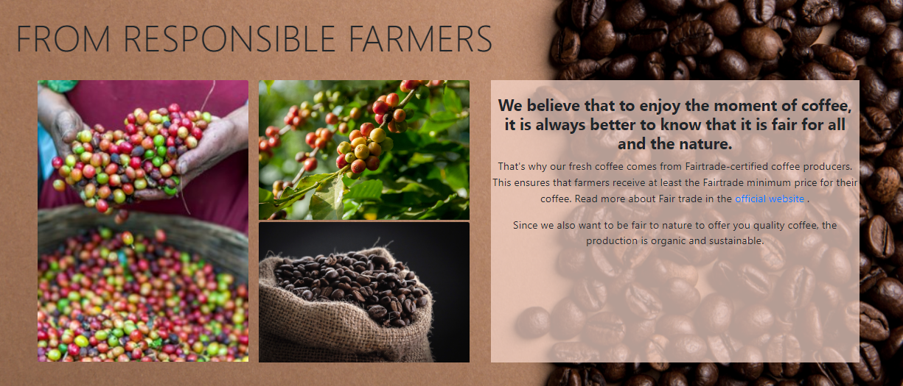
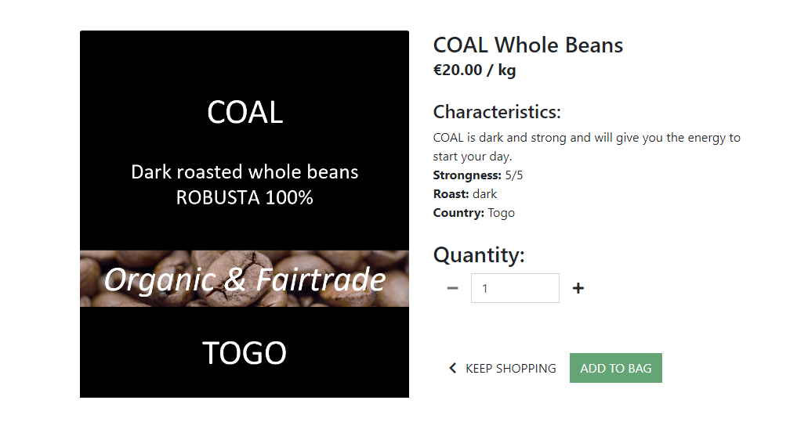

<h1 align="center"> Project 5 for Code Institute formation | COFFEE & NATURE | HTML - CSS - JS - DJANGO</h1>

[View the live project here.](https://project5-coffee-and-nature.herokuapp.com/)

COFFEE & NATURE is an e-commerce site that sells coffee. The store and the coffees are invented for the project.


This project is built as part of a project for the [code institute](https://codeinstitute.net/) (training to become a web developer). 

<h3 align="center"></h3>

The following details shall be used when attempting to submit an order on the checkout page:

Card Number: 4242 4242 4242 4242
Expiration Date: Any future date (e.g. 02/24)
CVC: Any three digits

# Table of content

[About The Project](#about-the-project) 

[Target audience](#target-audience)  

[User Experience](#user-experience)

[Features](#features)  

[Technologies used](#technologies-used)

[Tests](#tests)

[Deployment](#deployment) 

[Credits](#credits)

[Acknowledgments](#acknowledgments)


# Target audience

# User Experience
The details of the design evolution, user project can be found **[here](UXEVOLUTION.md)**. It includes diagrams, pictures, explanation of changes in the project process.

## User Story

The user stories for this project are:

<h3 align="center"></h3>


## Design Choices
- ### Fonts 
Default Font from bootstrap were kept, i.e:"Helvetica Neue", Helvetica, Arial, sans-serif, because it looks nice and it is and easy to read.

- ### Colors
As the idea of the project is to be inspired by nature, colors inspired by nature were chosen. The green color of the buttons represents the vegetation and the brown color represents the earth. The colors were also inspired by this [palette ](https://colorideas.net/roman-coffee-gray-kabul-dark-gray-smoked-color-palette/)

- ### Icons
Icons were used because they are visually pleasing and help users navigate the site. The icons were provided by Font Awesome. 


## Wireframes

### Home page
<details>
<h3 align="center"></h3>
</details>


# Features 

## Site-wide
- Responsiveness
The website is designed to be suitable for all devices. For example, the responsive navigation bar turns into a burger button for phone screens.

- Navbar
The navigation bar is consistent across all pages of the site and follows common practices that users have come to expect from navigation bars, e.g. a drop down menu for burgers appears on small devices, purchases are present with the price below.

- Search bar
The search bar finds cafes that contain the word the user is looking for, either in its name or in its description.

- Toasts
Toasts appear on all pages and provide the user with important information. These toasts also display the coffees that the user may have in their cart.

- Footer
The footer contains information about the store, such as its phone number, address and email address.

## Page-specific

- ### Home
The homepage displays a visually appealing hero image of coffee beans, which gives the user a clear idea of the type of website they just visited. It also provides a message about fresh coffee and a "SHOP NOW" button that connects the user to coffees available for purchase.


Under the hero section, there is a section where 4 coffees are displayed randomly with an animation on the large screens. The animation was not kept on the smaller screens because it made the site less clear.
<h3 align="center"></h3>

The next section is about the coffees presented as coming from responsible farmers, and then the countries of origin of the coffees on sale.

<h3 align="center"></h3>

- ### Shop

The coffees on sale are displayed on the store page.
Users can filter the coffees by species (Arabica, Robusta, mix of these 2 species), and by whole or ground beans in the COFFEE section of the navigation bar. 

Users have the possibility to sort coffees by price, grade, category, country, robustness, roasting in "SORT BY" in the navigation bar.

<h3 align="center"></h3>

- ### Products details
The product details display information about the coffee (its strength, roast, country of origin) and a picture of the product. Most of the information is already displayed on the product packaging.

In this page, users can select the quantity of the product they want.
<h3 align="center"></h3>


### Admin/Superusers
Have a link to edit and delete the product from the page.


- ### Bag
Allows user to adjust or delete products.
Displays the bag total, delivery and grand total of the order.
If the bag total is below the free shipping threshold, the amount required to qualify for free shipping is displayed.

<h3 align="center"></h3>

- ### Checkout
Displays the order summary and the form to enter the delivery details.

Payment is handled by Stripe.

### Registered users
If the delivery details have been previously recorded, the form will be pre-filled with them.


- ### Add edit delete


## Future

# SEO optimisation
In order to rank higher in searches, optimation was performed.
meta description and Key words were added. The chosen key words were:
fresh coffee
beans
responsible farmers
buy quality coffee
Taste
enjoy the moment
roasted

Links to information about responsible farmers was also added in order to offer the users valuable information as well as ranking higher in serches.  External link about Arabica and Robusta.


https://www.xml-sitemaps.com/ To do the site-maps file 

robots.txt


    
# Technologies used
## Languages used
- [HTML5](https://en.wikipedia.org/wiki/HTML5)
- [CSS3](https://en.wikipedia.org/wiki/Cascading_Style_Sheets)  
- [js](https://en.wikipedia.org/wiki/JavaScript)  
- [Python](https://en.wikipedia.org/wiki/Python_(programming_language))


## Frameworks
- [Bootstrap](https://getbootstrap.com/)

- [Django](https://www.djangoproject.com/)

- [GreenSock](https://greensock.com/)

- [jQuery](https://jquery.com/)

## Others

- [PostgreSQL](https://www.postgresql.org/) | database used in development mode and database in production mode

- [Git](https://git-scm.com/) | used as version control system

- [Gitpod](https://gitpod.io/workspaces) | used to code, commit to git and push the codes to github

- [GitHub](https://github.com/) | used to store the project code, show it and organize the project using agile tools

- [Jira](https://www.atlassian.com/software/jira/)| used to learn using an agile tool that gives project management tool

- [Balsamiq](https://balsamiq.com/) |  used to create the wireframe

- [Powerpoint](https://simple.wikipedia.org/wiki/Microsoft_PowerPoint) | used to create images from screenshots, work with images and plan the project

- [excel](https://www.microsoft.com/en-us/microsoft-365/excel) | used to plan the tasks and orgamize the project

- [Word](https://en.wikipedia.org/wiki/Microsoft_Word) | used to correct the grammar

- [am I responsive?](http://ami.responsivedesign.is/) | used to look at the responsiveness of the website and to present an introductory picture in the readme file

- [W3C Markup Validation Service](https://validator.w3.org/) | used to check the validity of the HTML code

- [W3C CSS Validation service](https://jigsaw.w3.org/css-validator/) | used to check the validity of the CSS code

- [Chrome DevTools](https://developer.chrome.com/docs/devtools/) | used to inspect the elements, codes and to see the how the site look like on various phones and tablets

- [DeepL](https://www.deepl.com/) | used to translate words from French to English and to write the content of the website and the 'Read me' file

- [Linguee](https://www.linguee.com/) | used to translate nouns, verify the gender and get the plural of the nouns.

- [cloudinary](https://cloudinary.com/) | used to store images

- [Inkscape](https://inkscape.org/) | used to create the favicon

- [heroku]

# Tests
The details of testing can be found [here](TESTING.md).


# Deployment
## GitHub Pages
The project was stored in GitHub and deployed in Heroku. Heroku Postgres was used for the database. Cloudinary to store the pictures.

## Making a Local Clone
- Log in to GitHub and locate the GitHub Repository.
- Click the Code drop down menu.
- Either download the ZIP file, unpackage locally and open with IDE OR to clone the repository using HTTPS, under "Clone with HTTPS", copy the link.
- Open Git Bash
- Change the current working directory to the location where you want the cloned directory to be made
- Type `git clone`, and then paste the URL you copied.
- Press Enter. Your local clone will be created.
- Create a file called env.py to hold your app's environment variables, which should contain the following:
```console
import os

os.environ["DATABASE_URL"] = "app database"
os.environ["SECRET_KEY"] = "app secret key"
os.environ["CLOUDINARY_URL"] = "cloudinary URL"

```
- Make sure the following are listed in your .gitignore file to prevent any environment variables being pushed publicly:
`env.py`


### Installing required softwares
In the terminal enter 

`pip3 install -r requirements.txt`

### Applying database migrations
In the terminal enter 
```
python manage.py migrate
```
### Creating a new superuser
```
python manage.py createsuperuser
```

### The app can now be run locally using
```
python manage.py runserver
```

## Heroku Deployment
- Register or login [Heroku](https://id.heroku.com/login)
- Choose a unique name for the app and the location nearest to you.
- Under **Resources** search for and add **Heroku Postgres** to your app
- In your local environment in the env.py file, enter the database URL (to find the URL, in HEROKU go to settings --> click "Reveal Config VARS")
- In Heroku, add a SECRET_KEY var (must be the same as the one in your env.py file)
- Add the hostname of your Heroku app to settings.py
```
ALLOWED_HOSTS = ['YOUR-APP-NAME.herokuapp.com', 'localhost']
```
- In Heroku, select the **Deploy** tab and under **Deployment method** choose GitHub
- In **Connect to GitHub** enter your GitHub repository details and once found, click **Connect**
- under **Manual deploy** choose **Deploy Branch**

- The steps from the previous section have to be repeated to load data in the new database (can be done in the local environment):
  - Applying database migrations
  - Creating a new superuser


## Cloudinary

# Credits

## Code credits
[code institute](https://codeinstitute.net/) - Parts of the code throughout the website have been adapted from the courses.
A lot of the code for this site was taken and adapted from the Boutique Ado walkthrough project.

[w3schools](https://www.w3schools.com/) - Used throughout the project.

[stakocverflow](https://stakocverflow.com/) - Used throughout the project.

[mdbootstrap](https://mdbootstrap.com/docs/standard/navigation/footer/) - The code of the footer was adapted from these examples.


## Read me file credits
Some parts of the readme file from [farrelleoin93](https://github.com/farrelleoin93/12-acres-beer) have been adapted to write this readme file.

## Pictures credits
https://www.countryflags.com/ethiopia-flag-image/

## Inspiration website


# Acknowledgments
- My mentor, Nishant Kumar, for giving me the direction to start the project, for guiding me through the project, for giving me the idea to implement new features and for giving me feedback.

- Andras Raab for the suggestions to improve the design.

- The Slack community for clarifying certain concepts, sharing tips and links and, of course, for always helping me with the codes.

- The tutors in Code institutes for helping with the codes.
