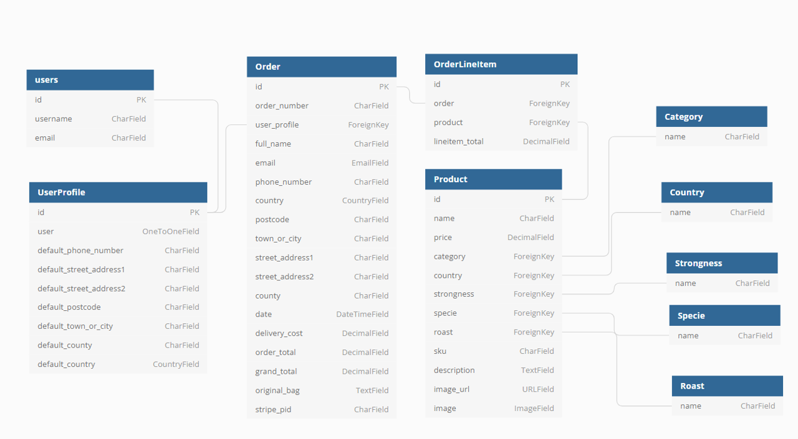

# UX

## Origin of the idea
For the formation with code institute the last project of my formation is to make an ecommerce. I decided to make an ecommerce that sells coffee because I love coffee and I find fresh coffee very pleasant to drink.

## Products design
I invented and created the coffee packaging. To do this I researched the type of coffee found in the world and chose 4 countries that produce coffee. Then for each country, I chose a theme inspired by nature as suggested by the brand of the invented store.

 BRAZIL --> Landscapes (sea, forest, mountain)

 ETHIOPIA --> Elements (gold, copper, iron)

 PERU --> Flowers (violet, rose, dianthus)

 TOGO --> Sedimentary rocks (coal, chalk, breccia)

I then designed the packaging using colors inspired by the product name.

### Data organisation:
The characteristics of the products were written in an excel file where I tried to keep the characteristics consistent with the type of coffee and the country of origin.
From the excel file with the characteristics, I started to design the models for the products and later on made json file with the information to load the data (to be found in "products --> fixtures")

## Database model
A relational database was used for this project. The database can be seen in the diagram below (made with [dbdiagram.io](https://dbdiagram.io/)):
<h3 align="center"></h3>

## Project 5 planification and evolution
Tasks and user stories have been entered into Github under issues and project.

## Design Choices
- ### Fonts 
Default Font from bootstrap were kept, i.e:"Helvetica Neue", Helvetica, Arial, sans-serif, because it looks nice, professionnal and it is and easy to read.

- ### Colors
As the idea of the project is to be inspired by nature, colors inspired by nature were chosen. The green color of the buttons represents the vegetation and the brown color represents the earth. The colors were also inspired by this [palette ](https://colorideas.net/roman-coffee-gray-kabul-dark-gray-smoked-color-palette/)

- ### Icons
Icons were used because they are visually pleasing and help users navigate the site. The icons were provided by Font Awesome. 

## Wireframes

    
Home

    <h3 align="center"></h3>  

    
Products

    <h3 align="center"></h3>  

    
Product Detail

    <h3 align="center"></h3>  

    
Bag

    <h3 align="center"></h3>  

    
Checkout

    <h3 align="center"></h3>  

    
Profile

    <h3 align="center"></h3>  

    
Add Product

    <h3 align="center"></h3>  

### Login / out /register
It was planed to use Allauth for the system and to adapt the default templates from Allauth to match the rest of the website.

