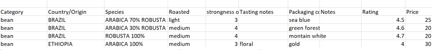

# User design evolution

## Origin of the idea
For the formation with code institute the last project of my formation is to make an ecommerce. I decided to make an ecommerce that sells coffee because I love coffee and I find fresh coffee very pleasant to drink.

## Products design
I invented and created the coffee packaging. To do this I researched the type of coffee found in the world and chose 4 countries that produce coffee. Then for each country, I chose a theme inspired by nature as suggested by the brand of the invented store.

 BRAZIL --> Landscapes (sea, forest, mountain)

 ETHIOPIA --> Elements (gold, copper, iron)

 PERU --> Flowers (violet, rose, dianthus)

 TOGO --> Sedimentary rocks (coal, chalk, breccia)

 I then designed the packaging using colors inspired by the product name.

Then, the characteristics of the products were written in an excel file where I tried to keep the characteristics consistent with the type of coffee and the country of origin.
 <h3 align="center"></h3>

### Data organisation:
<h3 align="center"></h3>

## Project 5 planification

The tasks have also been entered into Jira, which makes it possible to follow the progress of the project. For a team project, Jira also allows you to work as a team on a project. 
<h3 align="center"></h3>

### Data model
Models were designed as the folling diagram:
<h3 align="center"></h3>

## Evolution of the design.
The design of the site evolved during the project as I received feedback from my friends, family, mentor and got new ideas while making the project.

## Design Choices
- ### Fonts 
Default Font from bootstrap were kept, i.e:"Helvetica Neue", Helvetica, Arial, sans-serif, because it looks nice, professionnal and it is and easy to read.

- ### Colors
As the idea of the project is to be inspired by nature, colors inspired by nature were chosen. The green color of the buttons represents the vegetation and the brown color represents the earth. The colors were also inspired by this [palette ](https://colorideas.net/roman-coffee-gray-kabul-dark-gray-smoked-color-palette/)

- ### Icons
Icons were used because they are visually pleasing and help users navigate the site. The icons were provided by Font Awesome. 

## Database model
A relational database was used for this project. The database can be seen in the diagram below:

## Wireframes

### Home page

<h3 align="center"></h3>

